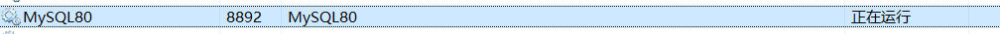
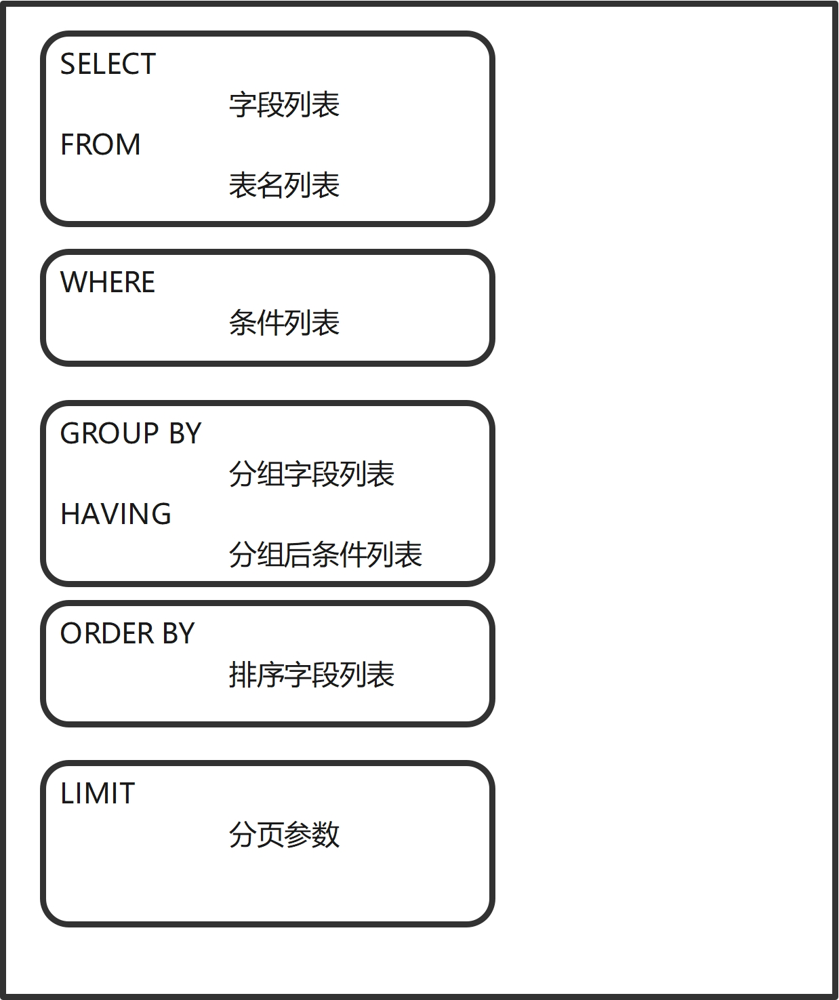
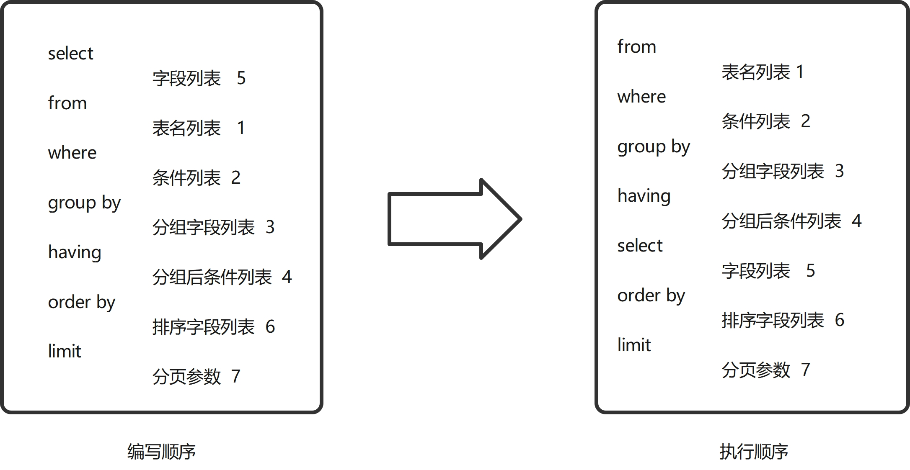
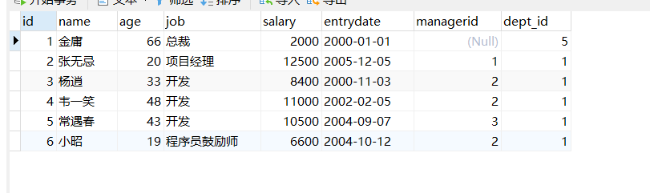
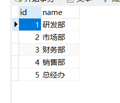

# 一、数据库相关概念
| 名称 | 全称 | 简称|
| :--- | :---| :---|
| 数据库 | 存储数据的仓库，数据是有组织的进行存储 | DataBase(DB) |
| 数据库管理系统 | 操作和管理数据库的大型软件 | DataBase Management System(DBMS) | 
| SQL | 操作关系型数据库的编程语言，定义了一套操作关系型数据库统一标准 | Structured Query Language(SQL) | 

# 二、软件安装
本文档教程以windows系统下的mysql为例，**版本信息**（mysql  Ver 8.0.29 for Win64 on x86_64 ）   

[官方下载链接（windows版）](https://dev.mysql.com/downloads/installer/ )

[其他方式下载链接参考](https://dev.mysql.com/downloads/)

[官方文档参考 ](https://dev.mysql.com/doc/)

- 服务器启动   
在windows打开服务即可查看(注意服务名)


- 客户端连接
  
```sql
mysql [-h 主机ip]  [-P 端口号] -u 用户名  -p 
```

```sql
C:\Users\xxr>mysql -u root -p
Enter password: ******
Welcome to the MySQL monitor.  Commands end with ; or \g.
Your MySQL connection id is 11
Server version: 8.0.29 MySQL Community Server - GPL

Copyright (c) 2000, 2022, Oracle and/or its affiliates.

Oracle is a registered trademark of Oracle Corporation and/or its
affiliates. Other names may be trademarks of their respective
owners.

Type 'help;' or '\h' for help. Type '\c' to clear the current input statement.

mysql>

```

环境变量设置   


# 三、Mysql数据库(RDBMS)
概念：建立在关系模型基础上，由多张相互连接的二维表组成的数据库。   
特点：   
1. 使用表存储数据，格式统一，便于维护。
2. 使用SQL语言操作，标准统一，使用方便，

示例图：   
 

 客户端通过DBMS来管理数据库里的数据。

# 四、SQL通用语法与分类
## 4.1 通用语法
1. SQL语句可以单行或多行书写，以分号结尾
2. SQL语句可以使用空格/缩进来增强语句的可读性。
3. MySQL数据库的SQL语句不区分大小写，关键字建议使用大写。
4. 注释：
- 单行注释：--注释内容  #注释内容
- 多行注释：/*注释内容*/

## 4.2 SQL分类

DDL(Data Definition Language)
- 数据定义语言，用来定义数据库对象（数据库，表，字段）

DML(Data Manipulation Language)
- 数据操作语言，用来对数据库表中的数据进行删改。
  

DQL(Data Query Language)
- 数据查询查询语言，用来查询数据库中表的记录

DCL(Data Control Language)
- 数据控制语言，用来创建数据库用户，控制数据库的访问权限。


# 五、基础DDL操作
## DDL-数据库操作
1. 查询   
查询所有数据库
```sql
SHOW DATABASES;
```
查询当前数据库
```sql
SELECT DATABASE();
```

- 创建(字符集推荐使用utf8mb4)  
```sql
CREATE DATABASE [IF NOT EXISTS] 数据库名 [DEFAULT CHARSET 字符集] [COLLATE 排列规则];
```

- 删除   
```sql
DROP DATABASE [IF EXISTS] 数据库名;
```

- 使用   
```sql
USE 数据库;
```

## DDL-表操作-查询
- 查询当前数据库所有表
```sql
SHOW TABLES;
```

- 查询表结构
```sql
DESC 表名;
```

- 查询指定表的建表语句

```sql
SHOW CREATE TABLE 表名;
```

## DDL-表操作-创建

```sql
-- 注意：[...]为可选参数，最后一个字段后面没有逗号--
CREATE TABLE 表名(
    字段1  字段1类型[COMMENT  字段1注释],
    字段2  字段2类型[COMMENT  字段2注释],
    ...
    字段n  字段n类型[COMMENT  字段n注释]
)[COMMENT 注释];

create table if not exists tb_user(
id int comment "编号",
name varchar(50) comment "姓名",
age int comment "年龄",
gender varchar(1) comment "性别"
);
```

## DDL-表操作-数据类型
主要可以分为3类： 数值类型，字符串类型和日期时间类型。

参考链接： [数据库类型](https://blog.csdn.net/commasx/article/details/87631069)

数值类型


字符串类型


日期类型


- 案例    
设计一张员工信息表，要求如下：
1. 编号（纯数字）
2. 员工工号（字符串类型，长度不超过10位）
3. 员工姓名（字符串类型，长度不超过10位）
4. 性别（男/女，存储一个汉字）
5. 年龄（正常人年龄，不可能存储负数）
6. 身份证号码（二代身份证位18位）
7. 入职时间（取值年月日）

```sql
CREATE TABLE emp(
   id int comment "编号",
   worknu  varchar(10) comment "员工工号",
   workname varchar(10) comment "员工姓名",
   gender  char(1) comment "性别",
   age int UNSIGNED COMMENT "年龄",
   idcard char(18) COMMENT "身份证",
   entrydate DATE COMMENT "入职时间"
) COMMENT "员工表";
```

## DDL-表操作-修改
- 添加字段
```sql
ALTER TABLE 表名 ADD 字段名  类型(长度) [COMMENT 注释]  [约束];
```

案例：   
为emp表增加一个新的字段"昵称"为nickname，类型为varchar(20)

```sql
ALTER  TABLE emp ADD nickname varchar(20) COMMENT "昵称";
```

- 修改数据类型   
```sql
ALTER TABLE 表名 MODIFY 字段名  新数据类型(长度);
```

- 修改字段名和字段类型
```sql
ALTER TABLE 表名 CHANGE  旧字段名 新字段名 类型（长度） [COMMENT 注释] [约束];
```

- 删除字段
```sql
ALTER TABLE 表名  DROP 字段名;
```

- 修改表名
```sql
ALTER TABLE 表名  RENAME TO 新表名;
```

- 删除表
```sql
DROP TABLE [IF EXISTS] 表名;
```

- 删除指定表，并重新创建该表（删除数据，留下空表）
```sql
TRUNCATE TABLE 表名;
```
**注意删除表，也会导致数据删除**

# 六、DML
## DML介绍
DML英文全称是Data Manipultaion  language(数据库操作语言)，用来对数据库中表的数据记录进行增删改操作。
- 添加数据（INSERT）
- 修改数据(UPDATE)
- 删除数据（DELETE）

## DML-添加数据
1. 给指定字段添加数据
```sql
INSERT  INTO  表名(字段名1,字段名2,...) VALUES(值1,值2,...)；
```

2. 给全部字段添加数据
```sql
INSERT INTO 表名  VALUES(值1,值2,...);
```

3. 批量添加数据
```sql
INSERT INTO 表名(字段1,字段2,...) VALUES(值1,值2,...),(值1,值2,...),(值1,值2,...);

--如果不指定字段名，那么默认以表的字段名顺序插入数据--
INSERT INTO 表名  VALUES(值1,值2,...),(值1,值2,...),(值1,值2,...);
```

注意：
- 插入数据时，指定的字段顺需要与值的顺序是一一对应的。
- 字符串和日期型数据应该在引号中。
- 插入数据的大小，也要符合规定值的范围

## DML-修改数据
```sql
UPDATE 表名 SET 字段名=值1,字段名2=值2,...[WHERE 条件];

/*注意：修改语句的条件可以有，也可以没有，如果没有条件，则会修改整张表的所有数据*/
```

- 示例：
1. 修改id为1的数据，将李四改完李七。
```SQL
UPDATE employ SET workname="李七" WHERE id=1;
```

2. 将所有的员工入职日期修改为2007-02-08
```sql
UPDATE employ SET entrydate="2007-02-08";
```

## DML-删除数据
```sql
DELETE FROM 表名 [WHERE 条件];
```

注意：
- DELETE语句条件可以有，也可以没有，没有的条件的话，就会删除整张表的所有数据。
- DELETE语句不能删除某一个字段的值（可以使用UPDATE）。

# 七、DQL-介绍
- DQL-介绍
  DQL英文全称Data Query Language(数据查询语言)，数据查询语言，用来查询数据库中表的记录。

  查询关键字：SELECT    

  ## DQL-语法   

```sql
  SELECT 
     字段列表
  FROM
     表名列表
  WHERE
     条件列表
  GROUP BY
     分组字段列表
  HAVING 
     分组后条件列表
  ORDER BY
     排序字段列表
  LIMIT
     分页参数
```

- 基本查询
- 条件查询（WHERE）
- 聚合函数（count、max、min、avg、sum）
- 分组查询（GROUP BY）
- 排序查询（ORDER BY）
- 分页查询（LIMIT）

## 7.1 DQL-条件查询
1. 语法
```sql
SELECT 字段列表  FROM  WHERE 条件列表;
```
2. 条件

| 比较运算符 | 功能  |
| :---| :-----------|
| >  | 大于         |
| >= | 大于等于     |
| <  | 小于         |
| <= | 小于等于      |
| =  | 等于         | 
| <>或!= | 不等于   |
| BETWEEN...AND... | 在某个范围之内（含最小，最大值） |
| IN(...)  | 在in之后的列表中的值，多选一 |
| LIKE 占位符  | 模糊匹配（_匹配单个字符，%匹配任意个字符） |
| IS NULL  | 是NULL  |

 

| 逻辑运算符  | 功能  |
| :---   | :-----|
| AND 或 &&   | 并且（多个条件同时成立） |
| OR 或 \|\|   | 或者（多个条件任意成立一个） |
| NOT 或 !  | 非，不是  | 

## 7.2  题目测试
-  条件查询
1. 查询年龄等于45的员工
```sql
SELECT * FROM employ WHERE age = 45;
```

2. 查询年龄小于30的员工信息
```sql
SELECT * FROM employ WHERE age < 30;
```

3. 查询没有身份证信息的员工信息
```sql
SELECT * FROM employ WHERE idcard is NULL;
```

4. 查询性别为女，且年龄小于40的员工信息
```sql
SELECT * FROM employ WHERE gender="女" AND age < 40;
```

5. 查询姓徐的员工信息。
```sql
SELECT * FROM employ WHERE workname LIKE "徐%";
```

6. 查询年龄等于18或20或40的员工信息
```sql
SELECT * FROM employ WHERE age IN(18,20,40);
```

7. 查询身份证是320开头的员工信息
```SQL
SELECT * FROM employ WHERE idcard LIKE "320%";
```

## 7.3 DQL-聚合函数
1. 介绍
   将一列数据作为一个整体，进行纵向计算。

2. 常见的聚合函数

| 函数   |  功能   |
| :------|:-------|
| count | 统计数量 |
| max   | 最大值   |
| min   | 最小值   |
| avg   | 平均值   |
| sum   | 求和     | 

3. 语法
```sql
SELECT 聚合函数(字段列表) FROM  表名;
```
4. 题目测试
```sql
-- 1. 统计该企业员工数
SELECT count(id)  FROM employ;

-- 2. 统计该企业的平均年龄
SELECT AVG(age) FROM employ;

-- 3. 统计该企业的最小和最大年龄
SELECT MIN(age) FROM employ;

SELECT MAX(age) FROM employ;

-- 4. 统计男性年龄之和
SELECT SUM(age) FROM employ WHERE gender="男";

```

注意：null值不参与所有聚合函数的运算。

## 7.4 DQL-分组查询
- DQL-分组查询
1. 语法
```SQL
SELECT 字段列表 FROM 表名 [WHERE 条件] GROUP BY 分组字段名 [HAVING 分组后过滤条件];
```
2. where和having的区别
- 执行时机不同：where是分组之前进行过滤，不满足where条件，不参与分组；而having是分组之后对结果进行过滤。
- 判断条件不同：where不能对聚合函数进行判断，而having可以。

3. 题目示例：
```SQL
-- 1. 根据性别分组，统计男性员工和女性员工的数量
SELECT COUNT(*) as peoNum FROM employ GROUP BY gender

-- 2. 根据性别分组，统计男性和女性员工的平均年龄
SELECT AVG(age) AS avgAge FROM  employ GROUP BY gender;

-- 3. 在查询年龄小于45的员工，并根据工作地址分组，获取员工数量大于等于3的工作地址
SELECT   city,COUNT(*) as cityPeoNum FROM emp  WHERE age < 45 GROUP BY city HAVING cityPeoNum >= 3;

```
注意：
- 执行顺序： where > 聚合函数 > having;
- 分组之后，查询的字段一般为聚合函数和分组字段，查询其他字段无任何意义。

## 7.5 DQL-排序查询
1. 语法
```sql
SELECT 字段列表 FROM  表名 ORDER BY 字段1 排序方式，字段2 排序方式;
```

2. 排序方式
- ASC：升序（默认值）
- DESC: 降序

注意：如果是多字段排序，当第一个字段值相同时，才会根据第二个字段进行排序。

3. 题目示例
```sql
-- 根据入职时间对员工进行排序
SELECT workname,entrydate FROM emp ORDER BY entrydate DESC;

-- 根据对员工进行先进行年龄排序，然后跟入职时间排序
SELECT workname,age,entrydate FROM emp ORDER BY age DESC,entrydate ASC;
```


## 7.6 DQL- 分页查询

1. 语法

   ```SQL
   SELECT 字段列表 FROM 表名 LIMIT 起始索引,查询记录数;
   ```


注意： 

- 起始索引从0开始，其实索引=（查询页面 - 1）* 每页显示记录
- 分页查询是数据库的方言，不同的数据库由不同的实现，Mysql中LIMIT
- 如果查询的是一页数据，起始索引可以省略，直接简写为limit 10

```sql
-- 1. 查询第一页员工的数据，每页展示10条数据
SELECT * from emp LIMIT 10;
-- 2. 查询第二页员工数据，每页展示10条记录
SELECT * from emp LIMIT 10,10;
```


## 7.7 案例测试

```SQL
 -- 1 查询年龄为20,21,22,23岁的员工信息
select * from emp WHERE age IN (20,21,22,23)

 -- 2 查询性别为男，并且年龄在20~40岁（含）以内，姓名为三个字的宋姓员工

select * from emp WHERE gender="男" AND age>=20 AND age<=40 AND workname LIKE "宋__";

select * from emp WHERE gender="男" AND (age BETWEEN 20 AND 40) AND workname LIKE "宋__";

-- 3 统计员工表中，年龄小于60岁的，男性员工和女性员工的人数

SELECT gender, COUNT(*) as people_num from emp WHERE age < 60 GROUP BY gender; 

-- 4 查询所有年龄小于等于35岁员工的姓名和年龄，并对查询结果按年龄升序排序，如果年龄相同按入职时间降序排序

SELECT  workname,age,entrydate FROM emp ORDER BY age ASC, entrydate DESC;

-- 5 查询性别为男，且年龄在20~40岁（含）以内的前5个员工信息，对查询的结果按年龄升序排序，年龄相同按入职时间升序排列。
SELECT * FROM emp WHERE  age >= 20 AND age <=40 ORDER BY age ASC,entrydate ASC LIMIT 5

```


## 7.8 DQL-执行顺序

- DQL-执行顺序




# 八、DCL-用户管理

## 8.1 DCL-介绍

​		DCL英文全称为Data Control Language(数据控制语言)，用来管理数据库用户、控制数据库的访问权限。

##  8.2 DCL-管理用户

1. 查询用户

```mysql
USE mysql;
SELECT * FROM user;
```

2. 创建用户

```mysql
CREATE USER '用户名'@'主机名' IDENTIFIED BY '密码';
```

3. 修改用户

```mysql
ALTER USER '用户名'@'主机名' IDENTIFIED WITH mysql_native_password BY '新密码';
```

4. 删除用户

```mysql
DROP USER '用户名'@'主机名';
```

注意：

- 主机名可以使用%通配，代表任意主机
- 这类SQL开发人员操作比较少，主要是DBA（Database Adminstrator 数据库管理员）使用。


## 8.3 DCL-权限控制

MySql中定义了很多种权限，但是常用的就以下几种：

| 权限               | 说明               |
| ------------------ | ------------------ |
| ALL,ALL PRIVILEGES | 所有权限           |
| SELECT             | 查询数据           |
| INSERT             | 插入数据           |
| UPDATE             | 修改数据           |
| DELETE             | 删除数据           |
| ALTER              | 修改表             |
| DROP               | 删除数据库/表/视图 |
| CREATE             | 创建数据库/表      |


- DCL-权限控制

1. 查询权限

```sql
SHOW GRANTS FOR '用户名'@'主机名';
```

2. 授予权限

```sql
GRANT 权限列表  ON 数据库.表名 TO '用户名'@'主机名';
```

3. 撤销权限

```sql
REVOKE 权限列表  ON 数据库名.表名 from '用户名'@'主机名';
```

注意：

- 多个权限之间，使用逗号分隔。
- 授权时，数据库名和表名可以使用*进行统配，代表所有。例如\*.\*代表所有数据库下的所有表。
- 所有权限可以使用all privileges字段代替


# 九、 函数

## 9.1 函数-字符串函数

函数 是指一段可以直接被另一段程序调用的程序或代码。

- 字符串函数（常用如下）

  | 函数                     | 功能                                                      |
  | ------------------------ | --------------------------------------------------------- |
  | CONCAT(S1,S2,...Sn)      | 字符串拼接，将S1,S2,....SN拼接成一个字符串                |
  | LOWER(str)               | 将字符串str全部转为小写                                   |
  | UPPER(str0)              | 将字符串str全部转为大写                                   |
  | LPAD(str,n,pad)          | 左填充，用字符串pad对str的左边进行填充，达到n个字符串长度 |
  | RPAD(str,n,pad)          | 右填充，用字符串pad对str的右边进行填充，达到n个字符串长度 |
  | TRIM(str)                | 去掉字符串的头部和尾部的空格                              |
  | SUBSTRING(str,start,len) | 返回从字符串str从start位置起的len个长度的字符串           |

  ```mysql
  -- concat 
  select concat('hello','mySQL');
  
  
  -- Lower
  SELECT lower('Hello');
  
  -- upper
  select upper('Hello');
  
  -- LPAD
  SELECT LPAD("01",5,"-");
  
  -- RPAD
  SELECT RPAD("01",5,'-');
  
  -- TRIM
  SELECT TRIM(" hello  world  ");
  
  -- SUBSTRING--->hello
  SELECT  SUBSTRING("hello world",1,5);
  
  -- SUBSTRING UPPER
  SELECT UPPER(SUBSTRING("hello world",1,5));
  ```

  

- 案例：由于业务需求变更，企业员工的工号，统一为5位数，目前不足5位数的全部在前面补0。比如：1号员工的工号位00001。

```mysql
UPDATE  emp SET worknu=LPAD(worknu,5,'0');

SELECT * from emp order by worknu 
```


## 9.2 函数-数值函数

常见数值函数如下：

| 函数       | 功能                               |
| ---------- | ---------------------------------- |
| CEIL(x)    | 向上取整                           |
| FLOOR(x)   | 向下取整                           |
| MOD(x)     | 返回x/y的模                        |
| RAND()     | 返回0~1内的随机数                  |
| ROUND(x,y) | 求参数x的四舍五入的值，保留y位小数 |

```sql

-- ceil -->2
select ceil(1.1);

-- FLOOR --> 1
select floor(1.6);

-- MOD(N,M)
SELECT mod(6,4);

-- rand
SELECT RAND();

-- ROUND(X,y) 随机值保留2位小数
SELECT ROUND(RAND(),2);
```


- 案例

  ```sql
  -- 根据数据库函数，生成员工六位数的随机验证码
  Select LPAD(ROUND(RAND()*1000000,0),6,"0");
  ```

  

## 9.3 函数-日期函数

| 函数                               | 功能                                              |
| ---------------------------------- | ------------------------------------------------- |
| CURDATE()                          | 返回当前日期                                      |
| CURTIME()                          | 返回当前时间                                      |
| NOW()                              | 返回当前日期和时间                                |
| YEAR(date)                         | 获取指定date的年份                                |
| DAY(date)                          | 获取指定date的日期                                |
| DATE_ADD(date, INTERVAL expr type) | 返回一个日期/时间值加上一个时间间隔expr后的时间值 |
| DATEDIFF(date1,date2)              | 返回起始时间 date1和结束时间date2之间的天数       |


```SQL
-- curdate()
SELECT CURDATE();

-- CURTIME()
SELECT CURTIME();


-- NOW()
SELECT NOW();

-- YEAR(date)
SELECT YEAR("2022-06-17 10:15:08");

-- MONTH(date)
SELECT MONTH("2022-06-17 10:15:08");

-- DAY(date)
SELECT DAY("2022-06-17 10:15:08");

-- DATE_ADD
SELECT DATE_ADD(NOW(), INTERVAL 2 DAY);

-- datediff
SELECT DATEDIFF(CURDATE(),"2022-08-1");
```


- 案例

  ```sql
  -- 查询所有员工的入职天数，并根据入职 天数倒序排列
  select workname, -DATEDIFF(entrydate,CURRENT_DATE) as entrydays ,entrydate  from emp ORDER BY entrydays desc;
  ```

  


## 9.4 流程函数

使用流程函数可以在SQL语句中实现条件筛选，提高语句效率。

| 函数                                                       | 功能                                              |
| ---------------------------------------------------------- | ------------------------------------------------- |
| IF(value,t,f)                                              | 如果value为true，则返回t, 否则返回f               |
| IFNULL(value1，value2)                                     | 如果value1不为空，返回value1, 否则返回value2      |
| CASE  WHEN [val1]  THEN [res] ... ELSE [default] END       | 如果val1为true，返回res1,...否则返回default默认值 |
| CASE [expr] WHEN [val1] THEN [res1] ... ELSE [default] END | 如果expr为val1，返回res1,...否则返回default默认值 |


```mysql
-- if
select if(1>0,"有该值",'空值');

SELECT if("你好"="hello","值相等","值不等");

-- IFNULL(expr1,expr2)
SELECT IFNULL('ok',"无此值");
SELECT IFNULL(null,"无此值");

-- case expr
SELECT 
	workname,
  (CASE  city WHEN "北京" THEN "一线城市" WHEN  "上海" THEN "一线城市" WHEN "江苏省" then "人口大省" ELSE "其他城市" END) as "工作省份" ,city
from emp;


-- 案例：统计班级各个学员的成绩，展示的规则如下：
-- >= 85,展示优秀
-- >= 60, 展示及格
-- 其他展示不及格

create TABLE score(
		id int COMMENT "ID",
		name VARCHAR(20)  COMMENT "姓名",
		math int  COMMENT "数学",
		english int  COMMENT "英语",
		chinese int  COMMENT "语文"
)  COMMENT "学员成绩表";

SELECT * from score;

desc score;

INSERT into score(id,name,math,english,chinese) VALUES(1,'Tom',67,88,95),(2,"Rose", 23, 66, 90);


SELECT 
	name,
	(case when math >= 85 then "优秀" when math >= 60 then "及格" else "不及格" END) as "数学",
	(case when english >= 85 then "优秀" when english >= 60 then "及格" else "不及格" END) as "英语",
	(case when chinese >= 85 then "优秀" when chinese >= 60 then "及格" else "不及格" END) as "语文"
from score;

```


# 十、约束

1.  概述： 约束是作用于表中字段上的规则，用于限制存储在表中的数据。

2.  目的：保证数据库中数据的正确、有效性和完整性。

3. 分类：

   | 约束                     | 描述                                                     | 关键字      |
   | ------------------------ | -------------------------------------------------------- | ----------- |
   | 非空约束                 | 限制该字段的数据不能为null                               | NOT NULL    |
   | 唯一约束                 | 保证该字段的所有数据都是唯一，不重复的                   | UNIQUE      |
   | 主键约束                 | 主键是一行数据的唯一标识，要求非空且唯一                 | PRIMARY KEY |
   | 默认约束                 | 保存数据时，如果未指定该字段的值，则采用默认值           | DEFAULT     |
   | 检查约束（8.0.16版本后） | 保证字段值满足某一个条件                                 | CHECK       |
   | 外键约束                 | 用来让两张表的数据之间建立连接，保证数据的一致性和完整性 | FOREIGN KEY |

   注意：约束是作用于表中字段上的，可以在创建表/修改表的时候添加约束。

   

- 案例： 根据要求完成表结构的创建

| 字段名 | 字段含义     | 字段类型    | 约束条件                  | 约束关键字                 |
| ------ | ------------ | ----------- | ------------------------- | -------------------------- |
| id     | ID唯一标识符 | int         | 主键，并且自动增长        | PRIMARY KEY,AUTO_INCREMENT |
| name   | 姓名         | varchar(10) | 不为空，并且唯一          | NOT NULL, UNIQUE           |
| age    | 年龄         | int         | 大于0，并且小于等于120    | CHECK                      |
| status | 状态         | char(1)     | 如果没有指定该值，默认为1 | DEFAULT                    |
| gender | 性别         | char(1)     | 无                        |                            |


```SQL
create table user(
id int PRIMARY KEY auto_increment COMMENT "ID唯一标识符",
name varchar(10) NOT NULL unique COMMENT "姓名",
age int  CHECK ( age > 0 && age <= 120 ) COMMENT "年龄",
status char(1)  DEFAULT 1 COMMENT "状态",
gender char(1) COMMENT "性别"

) COMMENT "用户表";
```


## 10.1 外键约束

1. 概念： 外键用来让两张表的数据建立连接，从而保证数据的一致性和完整性。

- 子表

   

- 父表



注意：目前上述两张表，在数据库层面，并未建立外键关联，所以是无法保证数据的一致性和完整性的。

```mysql
---------约束(外键)----------
create table dept(
		id int PRIMARY KEY auto_increment COMMENT "ID",
		name  VARCHAR(50) not null COMMENT "部门名称" 
) COMMENT "部门表"

insert into dept(id,name) VALUES(1,'研发部'),(2,'市场部'),(3,'财务部'),(4,'销售部'),(5,'总经办');

select  * from  dept;


---创建emp表格---
create table new_emp(
	id int auto_increment primary key comment "ID",
	name varchar(50) not null comment "姓名",
	age int  check ( age >0 && age <=120)  comment "年龄",
	job varchar(20) comment "职位",
	salary int comment "薪资",
	entrydate date comment '入职时间',
	managerid int comment '直属领导id',
	dept_id int comment '部门ID'
) comment '员工表';

insert into new_emp(id,name,age,job,salary,entrydate,managerid,dept_id) VALUES (1,"金庸",66,'总裁',2000,'2000-01-01',null,5),(2,'张无忌',20,'项目经理',12500,'2005-12-05',1,1),(3,"杨逍",33,'开发',8400,'2000-11-03',2,1),(4,"韦一笑",48,'开发',11000,'2002-02-05',2,1),(5,"常遇春",43,'开发',10500,'2004-09-07',3,1),(6,"小昭",19,'程序员鼓励师',6600,'2004-10-12',2,1)

```


- 语法

  - 添加外键

  ```mysql
  CREATE TABLE 表名(
  	字段名  数据类型,
      ...
      [CONSTRAINT] [外键名称] FOREIGN KEY(外键字段名) references 主表(主表列表)
  );
  ```

  ```mysql
  ALTER TABLE 表名 ADD CONSTRAINT 外键名称 FOREIGN KEY(外键字段名) REFERENCES 主表(主表列表);
  ```

  - 删除外键

  ```sql
  ALTER TABLE 表名 DROP FOREIGN KEY 外键名称;
  ```

  ```sql
  alter table new_emp drop foreign key fk_emp_dept_id;
  ```


## 10.2 外键删除更新行为

- 删除/更新行为

| 行为        | 说明                                                         |
| ----------- | ------------------------------------------------------------ |
| NO ACTION   | 当在父表中删除/更新对应记录时，首先检查该记录是否有对应外键，如果有则不允许删除/更新。（与RESTRICT一致。默认行为） |
| RESTRICT    | 当在父表中删除/更新对应记录时，首先检查该记录是否有对应外键，如果有则不允许删除/更新。（与NO  ACTION一致，默认行为） |
| CASCADE     | 当在父表中删除/更新对应记录时，首先检查该记录是否有对应外键，如果有，则也删除/更新外键在子表中的记录。 |
| SET NULL    | 当在父表中删除对应记录时，首先检查该记录是否有对应外键，如果有则设置子表中该外键值未null(这就要求该外键允许取null)。 |
| SET DEFAULT | 父表有变更时，子表将外键列设置成一个默认的值（Innodb不支持） |


```sql
ALTER TABLE 表名 ADD CONSTRAINT  外键名称  FOREIGN KEY (外键字段) REFERENCES 主表名(主表字段名) ON UPDATE CASCADE ON DELETE CAS
```


# 十一、多表查询

## 11. 1 多表关系

- 概述

​	项目开发中，在进行数据库表结构设计时，会根据业务需求及业务模块之间的关系，分析并设计表结构，由于业务之间的相互关联，所以各个表结构之间也存在各种联系，基本分为三种。

1. 一对多（多对一）
   - 案例：部门和员工的关系
   - 关系：一个部门对应多个员工，一个员工对应一个部门。
   - 实现：在多的一方建立外键，指向一的一方的主键。
2. 多对多
   - 案例：学生与课程的关系
   - 关系：一个学生可以选修多门课程，一门课程也可以供多个学生选择。
   - 实现：建立第三张中间表，中间表至少包含两个外键，分别关联两方主键。
